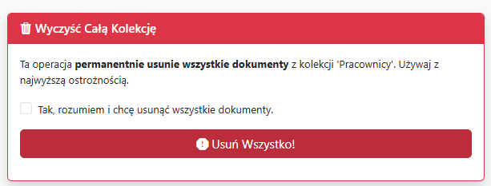

**MongoDB Manager** to aplikacja stworzona w ramach projektu z baz danych, umożliwiająca zarządzanie kolekcjami w MongoDB.

## 1. Kolekcje bazy danych

Użytkownik może wybrać kolekcję, na której chce wykonać operacje:

- `Pracownicy`
- `Produkty`
- `Klienci`
- `Zamówienia`

---

## 2. Wyświetlanie dokumentów

Użytkownik ma możliwość:

- Wybierania pól (np. `imie`, `wynagrodzenie`, `rok_zatrudnienia`)
- Doboru operatorów: `==`, `>`, `<`, itp.
- Określenia typu wartości: `String`, `Liczba`, `Data`
- Dodawania wielu warunków przy użyciu przycisku **Dodaj Warunek (AND)**
- Sortowania wyników (rosnąco/malejąco)
- Ustawienia limitu wyników

Po kliknięciu **Wyszukaj**, wyświetlają się:

- Szczegóły zapytania
- Lista wyników z danymi dokumentów (np. imię, stanowisko, email, ID)
- Możliwość podglądu każdego dokumentu

---

##  3. Aktualizowanie dokumentow

Użytkownik może:

- Wybrać z pól (np. `imie`, `wynagrodzenie`, `rok_zatrudnienia`)
- Doboru operatorów: `==`, `>`, `<`, itp.
- Określenia typu wartości: `String`, `Liczba`, `Data` itp.
- Dodawania wielu warunków przy użyciu przycisku **Dodaj Warunek (AND)**
- Wskazać operację aktualizacji (np.`$set`, `$inc`, `$mul`)
- Wskazać pole które ma uledz zmianie
- Wskazać wartość która zostanie podmieniona za stare dane
- Wskazać nowy typ wartości 
- Wybrać zakres:
  - `updateOne` – aktualizuje pierwszy pasujący dokument
  - `updateMany` – aktualizuje wszystkie pasujące dokumenty
- Zaznaczyć opcję **Upsert**, aby utworzyć dokument, jeśli żaden nie spełnia kryteriów
- Kliknąć **Wykonaj Aktualizację**, aby zastosować zmiany

  

Po operacji wyświetlane jest podsumowanie:

- Liczba dopasowanych dokumentów
- Liczba zmodyfikowanych dokumentów
- Szczegóły zapytania i wykonanych zmian

---

## 🗑️ 4.Usuwanie dokumentów

Użytkownik może:

- Wybrać z pól (np. `imie`, `wynagrodzenie`, `rok_zatrudnienia`)
- Doboru operatorów: `==`, `>`, `<`, itp.
- Określenia typu wartości: `String`, `Liczba`, `Data` itp.
- Dodawania wielu warunków przy użyciu przycisku **Dodaj Warunek (AND)**
- Wybrać zakres:
  - `updateOne` – aktualizuje pierwszy pasujący dokument
  - `updateMany` – aktualizuje wszystkie pasujące dokumenty
- Kliknąć **Wykonaj Usuwanie**, aby zastosować zmiany

  

Przed operacją wyświetlane jest ostrzeżenie o jej nieodwracalności.

Po wykonaniu:

- Liczba usuniętych dokumentów
- Szczegóły operacji

---

##  5. Edycja dokumentu po ID

Użytkownik może:

- Wprowadzić **ObjectId** dokumentu
- Wskazać pole do aktualizacji
- Wskazać nową wartość
- Wskazać typ nowej wartości
- Kliknąć **Zapisz Zmiany**, aby zaktualizować dokument

  

- Program wyswietla powiadomienie o pozytywnym wykonaniu polecenia

---

## 6. Czyszczenie całej kolekcji

Użytkownik może:

- Trwale usunąć **wszystkie dokumenty** z kolekcji( Obowiązkowo trzeba zaznaczyć pole **Tak, rozumiem i chcę usunąć wszystkie dokumenty**)
- Kliknąć **Usuń Wszystko!**, aby potwierdzić

Użytkownik potwierdza wykonanie operacji:

Aplikacja wyswitla komunikat o usunięciu dokumentów z kolekkcji:

---

## 7. Wyświetlanie zawartości poszczególnych kolekcji z możliwością ograniczenia liczby wyświetlanych dokumentów

## 8. Predefiniowane operacje

Aplikacja oferuje zestaw predefiniowanych operacji, podzielonych na trzy kategorie:

- **Wszystkie Wyszukiwania**  
  Szybki dostęp do najczęściej używanych zapytań:
  - Pracownicy na stanowisku 'Programista'
  - Pracownicy z wynagrodzeniem > X
  - Pracownicy zatrudnieni w 2023
  - Nieaktywni pracownicy

- **Agregacje**  
  Gotowe raporty i statystyki:
  - Średnie wynagrodzenie na stanowisko
  - Liczba pracowników na miasto
  - Popularność umiejętności
  - Średnie wynagrodzenie wg statusu aktywności

- **Aktualizacje**  
  Szybkie operacje modyfikujące dane:
  - Zwiększ wynagrodzenie Analitykom o 10%
  - Dezaktywuj losowego pracownika

Każda operacja może być uruchomiona jednym kliknięciem, a wyniki sa przedstawine w taki sam sposób jak przy operacjach dynamicznych.

## 9. Przycisk - Dodaj losowe

Użytkownik może dodać 10 dokumentów z losowymi danymi.

Po wykonaniu wyświetla się komunikat o wykonaniu zadania:

## 10. Zadania

### I. Dodaj po 10 dokumentów do kolekcji. | II. Wykonaj wyświetlanie zawartości poszczególnych kolekcji z możliwością ograniczenia liczby wyświetlanych dokumentów.

Użytkownik używa przycisku dodaj losowe w prawym górnym rogu strony, który dodaje 10 dokumentów wypełnionych losowymi danymi.
Czynność zostaje powtórzona we wszystkich czterech kolekcjach. 

Po naciśnięciu przycisku program wyświetla komunikat o dodaniu 10 dokumentów do kolekcji pracownicy.

Po naciśnięciu przycisku wyświetl dokumenty program przenosi użytkownika do strony, która wyświetla zawartości poszczególnych kolekcji z możliwością ograniczenia liczby
wyświetlanych dokumentów.

III. Wykonaj 6 przykładowych poleceń wyszukujących dokumenty spełniające narzucone kryteria

Polecenie 1:

Polecenie 2:

Polecenie 3:

Polecenie 4:

Jeżeli nie ma wyników wyszukiwania wyświetla się komunikat.

Polecenie 5:

Polecenie 6:

IV. Wykonaj 6 przykładowych poleceń aktualizujących dokumenty spełniające narzucone kryteria

Polecenie 1:

Polecenie 2:

Polecenie 3:

Polecenie 4:

Polecenie 5:

Polecenie 6:

V. Wykonaj 3 przykładowe polecenia wyszukujące dokumenty spełniające narzucone kryteria.

Polecenie 1:

Polecenie nie odnalazło dokumentów ponieważ wcześniej został on zupdatowany.

Polecenie 2:

Polecenie wyszukało użytkownika z imieniem Krystian czyli zgodnie z wcześniejszym updatem.

Polecenie 3:

Polecenie nie odnalazło dokumentów ponieważ we wcześniejszym updacie liczby mniejsze niż 9000 zostały pomnożone przez 7.

